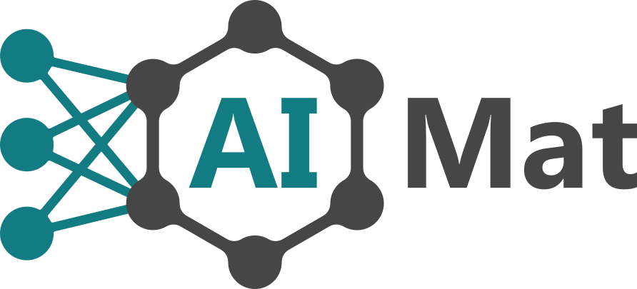

=============================
👩‍🔬 AIMAT Project Cookiecutter
=============================

Welcome!

So you have decided to do a thesis project with with the AIMAT_ group. This README file will walk you through the 
process of creating a basic structure of the code that you'll be using to conduct the computational experiments for 
the thesis. 

This structure will be created by the cookiecutter_ 🍪 template that is implemented in this repository.

.. note::

    Please note that this template is just a *recommendation*. If you want to built the code structure completely 
    then you are free to do so as well. However, this template exists to make it easier for you! At first it may 
    seem daunting because there are so many files, but you'll see that most of them are just necessary boilerplate
    and you'll be able to ignore most of them.

===========
🔥 Features
===========

Before we get right into how to instantiate this template for your own project, 
here are the most notable features that this template provides for you.

- **readme documentation outline. ** The template will already create a large portion of your project's own ``README.rst`` 
  file which will serve as part of your project documenation. This will in turn help the group to make use of your code even 
  after you finish your project with us.

============
🤓 Resources
============

In this section we provide a number of additional resources to read at your own leisure.

.. _AIMAT: https://aimat.iti.kit.edu/
.. _cookiecutter: https://github.com/cookiecutter/cookiecutter